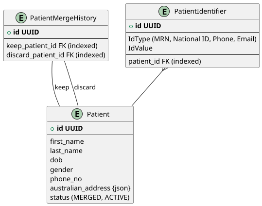

# TASK 1
- ERD

- code for automatch is at xs.test2.service.PatientService.autoMatchPatient
- sample of input output is at xs.test2.service.PatientServiceIntegrationTest.autoMatchPatient_whenPatientHasMatchingRecords_shouldReturnCorrectMatchScore

# TASK 2
- Install the pre-requisites for the project can be found in the README.md file.
- Run the project. You can use Quick Start section in README.md.

# Opinion
Unfortunately I forgot this line "Implement other framework or technologies are welcome". 
If I have the total liberty to develop fullstack application, I shall use Spring Boot Kotlin, Spring DATA JDBC (not JPA), Mustache template engine and HTMX.
The line of codes should be cut in half. Fullstack application should use fullstack optimized technologies.